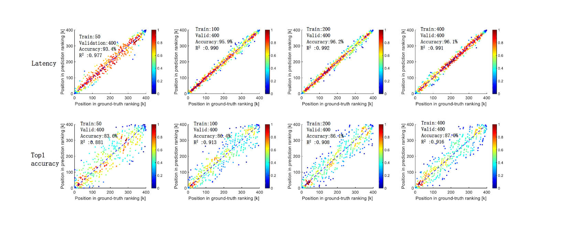

# MTLP-JP

## Multi-task learning-based prediction for joint ranking in neural architecture search

SOTA performance of **0.9435** in latency prediction and **0.8502** in top-1 prediction  with only **100 training points**

#### BRP results in latency prediction with various training points

| train points | accuracy | $R^2$ |
| ------------ | -------- | ----- |
| 50           | 93.4%    | 0.977 |
| 100          | 95.9%    | 0.990 |
| 200          | 96.2%    | 0.992 |
| 400          | 96.1%    | 0.991 |

#### BRP results in top-1 prediction with various training points

| train points | accuracy | $R^2$ |
| ------------ | -------- | ----- |
| 50           | 83.6     | 0.881 |
| 100          | 86.4%    | 0.913 |
| 200          | 86.1%    | 0.908 |
| 400          | 87.0%    | 0.916 |



## How to collect the dataset

If you want to collect the dataset on your own devices and platform, just run the following command.

```python
python get_latency.py
```

## How to train our model

##### Train_path, valid_path and test_path are the paths of your **csv** train file, valid file and test file.

##### To train and evaluate brp model

```python
python brp_mtl.py --train_file train_path --val_file valid_path --te_file test_path --lstm True -brp True
```

#### To train  and evaluate regression model

```python
python brp_mtl.py --train_file train_path --val_file valid_path --te_file test_path --lstm True -brp False 
```


## Requirements

- Python 3.6
- Pytorch 1.5.0
- tensorrt 7.2.1.6
- onnx 1.8.0
- numpy 1.19.2


